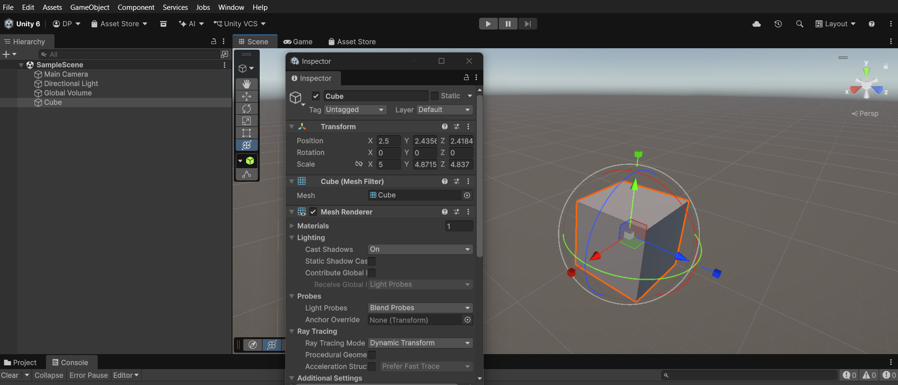

# Day 5 - Unity Editor and First GameObject

---

# Unity Editor Windows

The Unity Editor is made up of several windows, each with a specific purpose.

```
Unity Editor
│
├── Scene View
├── Game View
├── Hierarchy
├── Inspector
├── Project
└── Console
```

---

# Scene View

The Scene View is the developer's workspace.

It allows you to:

- Move around the scene
- Place GameObjects
- Rotate objects
- Scale objects

It is **not** what the player sees.

Think of it as the **developer's camera**.

---

# Game View

The Game View shows exactly what the **Main Camera** sees.

It represents what the player sees while playing the game.

Think of it as the **player's camera**.

---

# Scene View vs Game View

- **Scene View** → Used by the developer to build and edit the game world.
- **Game View** → Shows the game from the player's perspective.

---

# Hierarchy

The Hierarchy lists every GameObject in the current scene.

Examples:

- Main Camera
- Directional Light
- Cube
- Plane

It also stores **Parent-Child relationships**.

Example:

```
Player
│
├── Camera
├── Gun
└── Health Bar
```

If the Player moves, all child objects move together.

---

# Inspector

The Inspector displays all the components attached to the selected GameObject.

Example:

```
Cube
│
├── Transform
├── Mesh Filter
├── Mesh Renderer
└── Box Collider
```

The Inspector does not provide functionality itself—it allows us to **view and configure** the components attached to a GameObject.

---

# Project Window

The Project window is Unity's file explorer.

It contains project resources such as:

- Assets
- Scripts
- Scenes
- Materials
- Models
- Audio
- Packages

---

# Console

The Console displays:

- Debug.Log() messages
- Warnings
- Errors

Example:

```csharp
Debug.Log("Hello");
```

The output appears in the **Console Window**.

---

# Creating My First GameObject

Created a **Cube** using:

```
Hierarchy
→ Right Click
→ 3D Object
→ Cube
```


The Cube contained the following components:

- Transform
- Mesh Filter
- Mesh Renderer
- Box Collider

This matched what I learned on Day 4 about GameObjects and Components.

---

# Working with Transform

Using the Inspector, I changed the Cube's:

### Position

Moved the cube to a different location.

### Rotation

Rotated the cube.

### Scale

Changed the size of the cube.

This helped me understand that the **Transform** component controls an object's Position, Rotation, and Scale.

---

# Play Mode

Play Mode is used to test the game.

Since no scripts were added yet, nothing happened when entering Play Mode.

---

# Mini Challenge - Lamp GameObject

My Answer:

```
Lamp
│
├── Transform
├── Mesh Filter
└── Mesh Renderer
```

### Improved Version

```
Lamp
│
├── Transform
├── Mesh Filter
├── Mesh Renderer
├── Box Collider
├── Light
└── LampController Script
```

### Purpose of Each Component

- **Transform** → Position, Rotation, Scale
- **Mesh Filter** → Stores the lamp's 3D model
- **Mesh Renderer** → Makes the lamp visible
- **Box Collider** → Prevents the player from walking through it
- **Light** → Emits light
- **LampController Script** → Turns the lamp on/off or changes brightness

---

# My Understanding

- The Unity Editor contains different windows for different tasks.
- Scene View is for the developer, while Game View is what the player sees.
- The Hierarchy organizes every GameObject and their parent-child relationships.
- The Inspector displays and allows configuration of a GameObject's components.
- The Project window stores all project files.
- The Console displays debugging information, warnings, and errors.
- Every GameObject becomes useful by attaching the right components.
- I created my first GameObject (Cube) and modified its Transform using the Inspector.

---

# Summary

- Scene View = Developer Workspace
- Game View = Player View
- Hierarchy = List of GameObjects
- Inspector = View and Configure Components
- Project Window = Unity File Explorer
- Console = Debug Messages, Warnings, and Errors
- Transform = Position, Rotation, Scale
- Play Mode = Test the Game

---

✅ **Status:** Completed